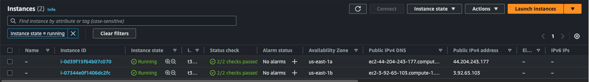

## Summary of the project:
In this project I will apply the skills and knowledge which were developed throughout the Cloud DevOps Nanodegree program. These include:
Working in AWS
Using Circle CI to implement Continuous Integration and Continuous Deployment
Building pipelines
Working with CloudFormation to deploy clusters
Building Kubernetes clusters
Building Docker containers in pipelines
# Git link:
https://github.com/thanhcamac/aws-capstone-devops.git
# Screenshot of the Circle CI or Jenkins pipeline showing all stages passed successfully.

# Screenshot of your AWS EC2 page showing the newly created (for blue/green) or modified (for rolling) instances running as the EKS cluster nodes.

# Screenshot of the kubectl command output showing that the deployment is successful, pods are running, and the service can be accessed via an external IP or port forwarding.

# Screenshot showing that you can access the application after deployment.

# Screenshot execute linting step in code pipeline
- Fail

- Success
